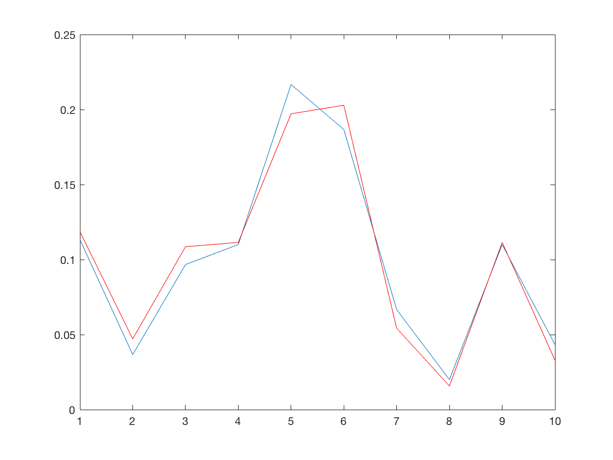
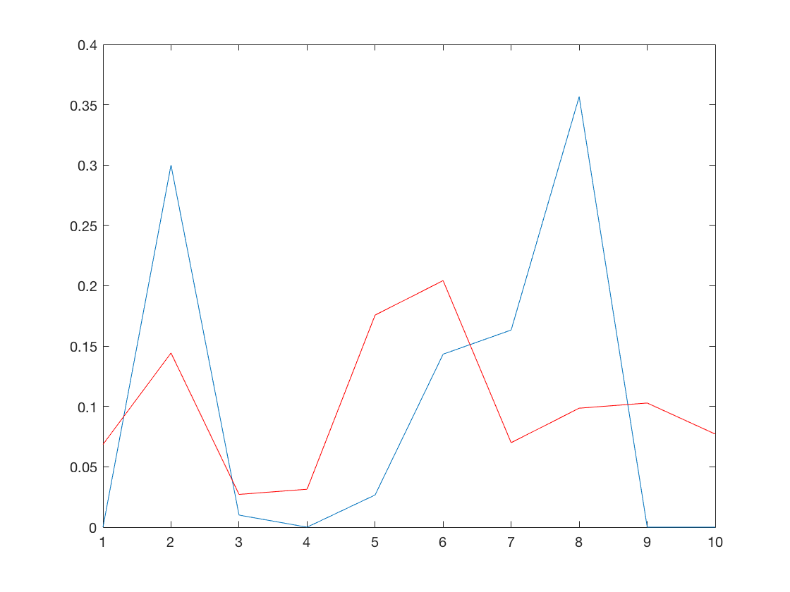

# Multivariate Distribution Hypothesis Test (MDHT) (2017.9.13 v.02)

## 1. 问题表述

### 1.1 背景

​	假设某公司现有两个plan：A & B. 假设两个方案的用户是random的，那么我们能够有足够自								信指出哪个plan更好

### 1.2 目的

​	设计一个test来判断两个data set是randomly picked $\Rightarrow$ 判断两个data set 两两对应 column的distribution是不是一样的，并满足：

​	1.2.1 控制 $\alpha$ level

​	1.2.2 尽可能使得test的powerful大

### 1.3 抽象化

data set  &  , where  and .


### 1.4 数据来源


***


## 2. 思路

大纲：将两个matrix和在一起，用聚类将数据分成若干子类，每一个子类可视为chi-square里的一个属性值，进行count，在此基础上沿用chi-square


### 2.1 Combine two matrices into one matrix C


### 2.2 K-means Clustering based on matrix C

### k-means clustering plot and (from matlab)




```Matlab
% for two sample is randomly picked

k = 10;
mu = [2,3];
sigma = [1,1.5;1.5,3];

rng(2)  % For reproducibility
r = mvnrnd(mu,sigma,1000);
A = r(1:300,:);
B = r(301:1000,:);
idx = kmeans(r,k);
idx_A = idx(1:300,:);
idx_B = idx(301:1000,:);
num_A = 1:k;
num_B = 1:k;

for i = 1:k
    num_A(i) = length(find(idx_A==i));
    num_B(i) = length(find(idx_B==i));
end

num_A = num_A/300;
num_B = num_B/700;
plot(1:10,num_A)
hold on
plot(1:10,num_B,'r')

```

***



```Matlab
% for two sample is clearly different

k = 10;
mu_1 = [2,3];
sigma_1 = [1,1.5;1.5,3];

mu_2 = [4,6];
sigma_2 = [4,6;6,12];

rng(2)  % For reproducibility
A = mvnrnd(mu_1,sigma_1,300);
B = mvnrnd(mu_2,sigma_2,700);
r = [A;B];

idx = kmeans(r,k);
idx_A = idx(1:300,:);
idx_B = idx(301:1000,:);
num_A = 1:k;
num_B = 1:k;

for i = 1:k
    num_A(i) = length(find(idx_A==i));
    num_B(i) = length(find(idx_B==i));
end

num_A = num_A/300;
num_B = num_B/700;
plot(1:10,num_A)
hold on
plot(1:10,num_B,'r')
```


### 2.3 建立chi-square test


## 3. Test Statistic Using chi-square test

